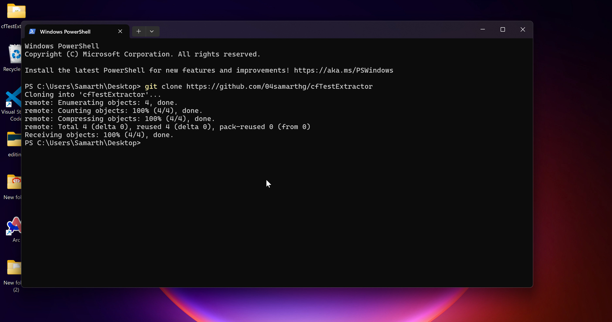
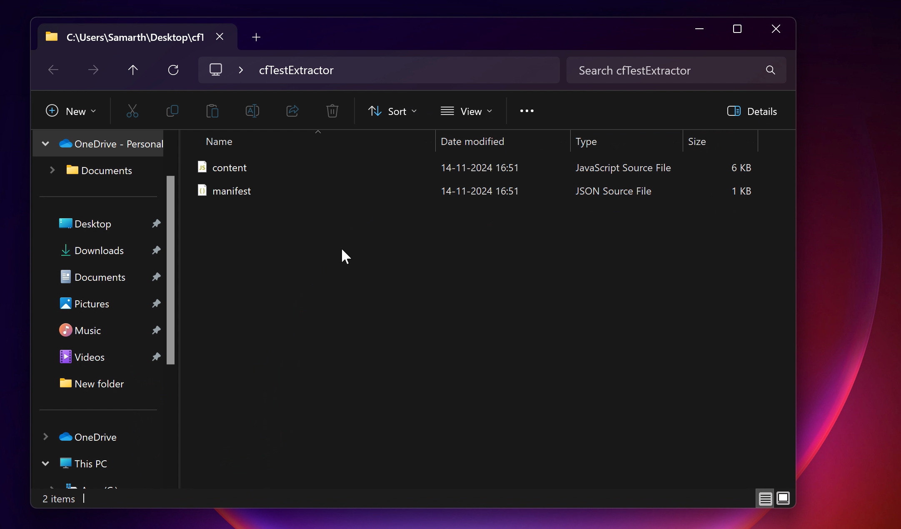
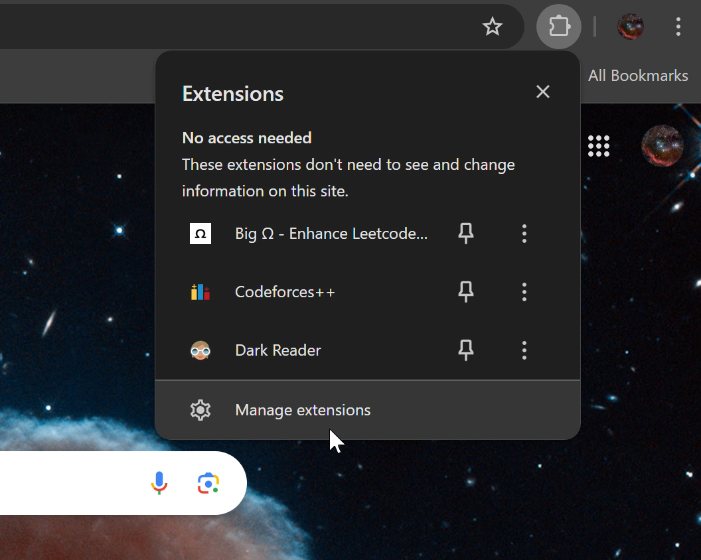
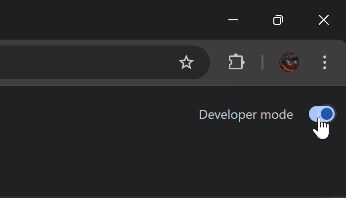
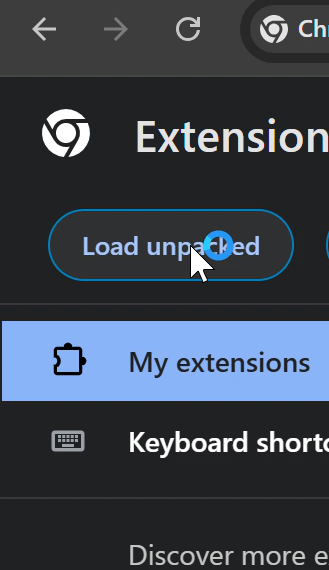
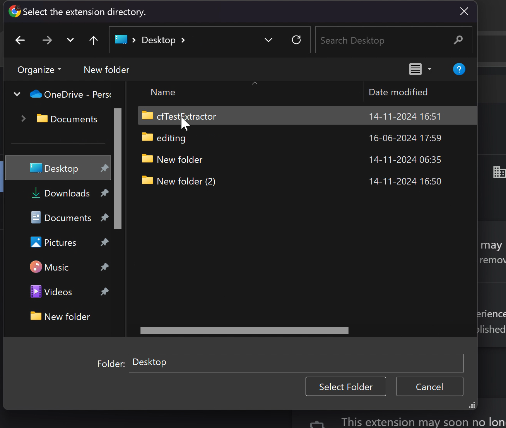
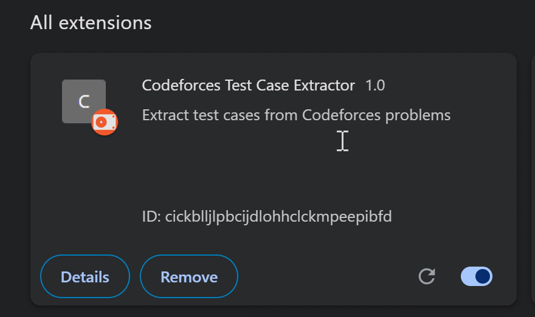
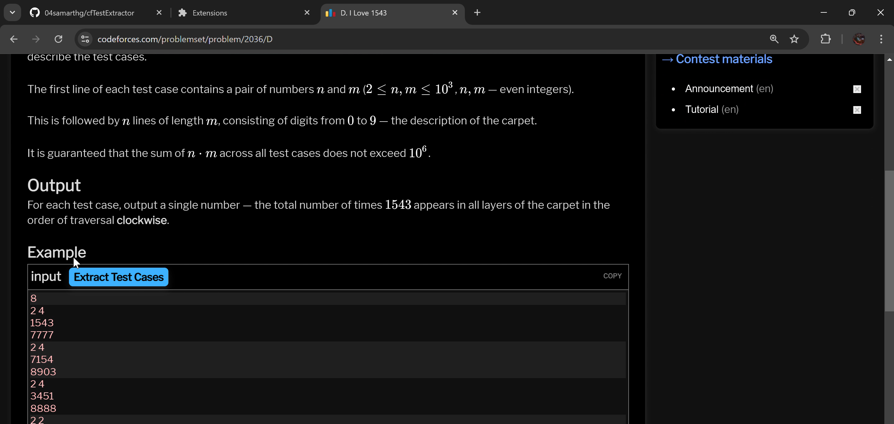
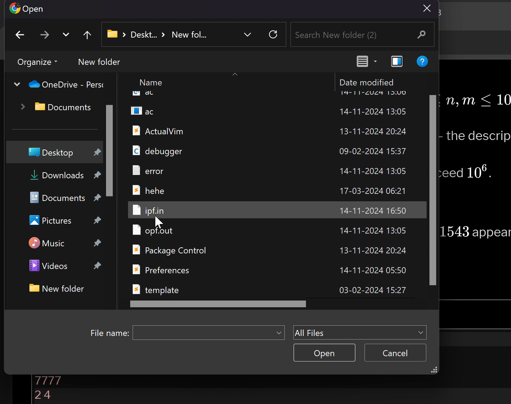

# Codeforces Test Case Extractor

A Chrome extension designed to make coding practice on Codeforces easier by extracting and saving test cases directly from problem pages into a text file. This extension lets you run tests locally with minimal setup.

## Features
- Adds an **Extract Test Cases** button next to each test case on Codeforces problem pages.
- Saves each test case in a text file, formatted with the input and expected output.
- Notifies the user of successful extraction or any errors encountered.
- Modern, user-friendly button design with hover effects.

## Installation and Usage

1. Clone the git repository:

   

2. You will be able to see the `content.js` and `manifest.json` files:

   

3. Now, go to Chrome and open the "Manage extensions" page:

   

4. Turn on the Developer mode:

   

5. Click on "Load unpacked" on the top left:

   

6. Now, select the cloned repository folder to open:

   

7. You will now see the Extension added in Chrome:

   

8. Now, you can use the extension on any problem:

   

9. Using the extension for the first time will ask you to pick your input file. Open your input file from a location that is accessible and does not require system permissions:

   

**Note:**
- Make sure the input file you use is placed in an accessible location, not in a place where system permissions are required.
- If you want to change the input file address, delete the entry from the IndexedDB in Chrome storage. You can learn how to do this by searching on Google.

```bash
git clone https://github.com/yourusername/Codeforces-Test-Case-Extractor.git


